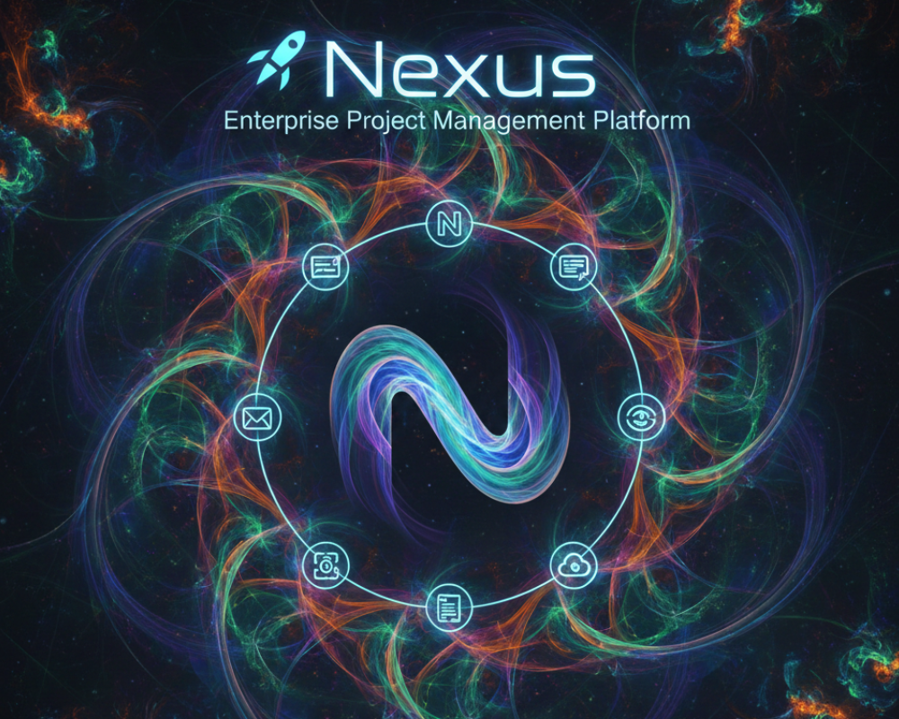

---



# 🚀 Nexus | Enterprise Project Management Platform.

**Nexus** is a high-performance, real-time collaboration tool designed to streamline project workflows. Built with the modern MERN stack (Next.js 15, Tailwind, and TypeScript), it features a hybrid architecture using a dedicated Node.js microservice for real-time WebSockets.

---

## 🛠 Tech Stack

| Layer | Technology | Key Usage |
| --- | --- | --- |
| **Frontend** | **Next.js 15 (App Router)** | Server Components, Streaming, and SEO |
| **Styling** | **Tailwind CSS + Shadcn/UI** | Utility-first styling & accessible components |
| **Language** | **TypeScript** | Type-safety across the entire stack |
| **Real-time** | **Socket.io** | Live task updates and workspace chat |
| **Database** | **MongoDB (Mongoose)** | NoSQL schema with Aggregation Pipelines |
| **Backend** | **Node.js / Express** | Dedicated microservice for WebSocket handling |
| **State** | **TanStack Query / Zustand** | Server-state caching and lightweight global state |
| **Auth** | **NextAuth.js + JWT** | OAuth (GitHub/Google) and secure JWT tokens |
| **Animations** | **Framer Motion** | Smooth UI transitions and drag-and-drop feedback |

---

## ✨ Key Features

* **Kanban Boards:** Advanced drag-and-drop task management powered by `@hello-pangea/dnd`.
* **Real-time Collaboration:** Instant updates when teammates move cards or edit descriptions.
* **Workspace Chat:** Built-in messaging system for every project room using WebSockets.
* **Smart Search:** High-performance task filtering using MongoDB indexing.
* **Role-Based Access (RBAC):** Granular permissions for Workspace Owners, Members, and Viewers.
* **Optimistic Updates:** Immediate UI feedback for actions like renaming boards or deleting tasks.
* **Dark Mode:** Native support via `next-themes`.

---

## 🏗 System Architecture

Nexus uses a **Hybrid Infrastructure**:

1. **Client/Server (Next.js):** Deployed on Vercel. Handles the main UI and data-fetching via Server Actions.
2. **Socket Microservice (Node/Express):** Deployed on a persistent server (e.g., Render/Railway). Handles long-lived WebSocket connections for real-time features.
3. **Database (MongoDB Atlas):** Managed cloud database with Mongoose ODM.

---

## 🚀 Getting Started

### Prerequisites

* Node.js 18+
* MongoDB Atlas Account
* GitHub/Google OAuth credentials

### Installation

1. **Clone the repository**
```bash
git clone https://github.com/saadsalmanakram/nexus.git
cd nexus

```


2. **Setup Frontend (Next.js)**
```bash
cd client
npm install
cp .env.example .env.local
npm run dev

```


3. **Setup Backend (Socket.io Server)**
```bash
cd ../server
npm install
cp .env.example .env
npm start

```


---

## 🧪 Testing & Quality

* **Unit/Integration:** Jest & React Testing Library.
* **E2E:** Playwright for critical user flows (Login, Create Project, Move Task).
* **Validation:** Zod for schema-first form and API validation.

---

## 📂 Repository Structure

```text
nexus/
├── client/              # Next.js frontend (App Router)
│   ├── components/      # Shadcn + Custom UI
│   ├── hooks/           # TanStack Query & Socket hooks
│   └── app/             # Routes and Server Actions
├── server/              # Node.js/Express WebSocket Microservice
│   ├── models/          # Mongoose Schemas
│   ├── socket/          # Socket.io event handlers
│   └── controllers/     # Express route logic
└── README.md

```

---

## 🤝 Contributing

Feel free to fork this project and submit PRs. For major changes, please open an issue first to discuss what you would like to change.

**Developed with ❤️ by [Saad Salman](https://github.com/saadxsalman)**


---
 