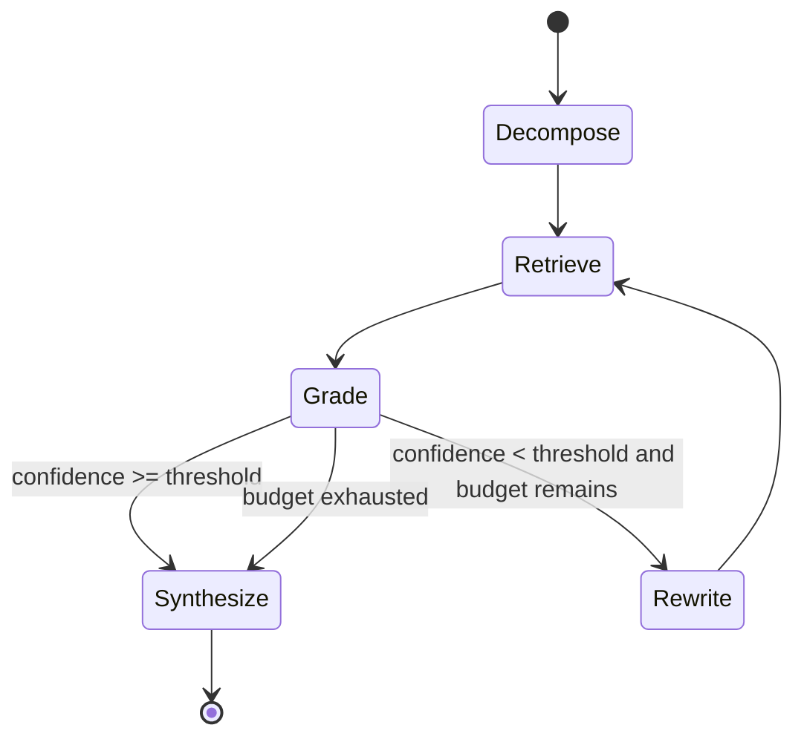

# Architecture Notes

## Runtime Boundaries

The Rust edge is the public boundary. It owns browser delivery, request forwarding, and the smallest possible amount of request validation. It never receives provider secrets. The Python service is private to the edge in a deployment and owns the agent state machine, retrieval, policy, model calls, and checkpoints.

## State Machine

Every state transition should be represented by an audit event in a production deployment. The current local implementation persists the question, iteration count, confidence, and trace in SQLite.

## Retrieval Contract

A retriever returns ranked evidence with a stable ID, title, excerpt, score, and kind. The graph does not care whether the backing implementation is lexical, pgvector, Chroma, or a remote search service. This allows offline evaluation and production replacement to share the same orchestration code.

## Trust Model

Retrieved content is untrusted data. It is never treated as an instruction. The synthesis prompt must keep the question and evidence in separate channels, source IDs must be preserved, and write-capable tools require a distinct approval path. MCP allowlists are deny-by-default in production.

## Failure Domains

- Model provider outage: fall back only when policy permits; never silently claim a provider succeeded.
- Vector store outage: return a typed degraded response or use the local index for development.
- Graph store outage: continue only if the query does not require relationship evidence.
- Checkpoint outage: fail closed for workflows requiring resumability.
- Tool timeout: record the timeout and continue with a bounded retry budget.

## Scaling

The agent service is stateless except for the checkpoint and corpus stores. Run multiple replicas behind the Rust edge once checkpoints and ingestion move to PostgreSQL. Use a separate ingestion worker for large files, a queue for embedding work, and tenant-scoped indexes for isolation.
